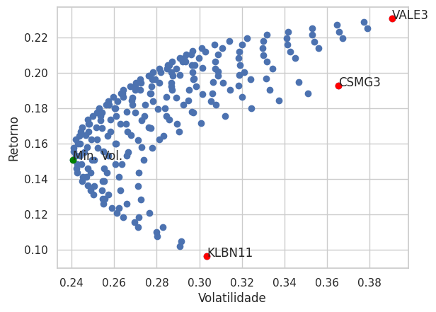
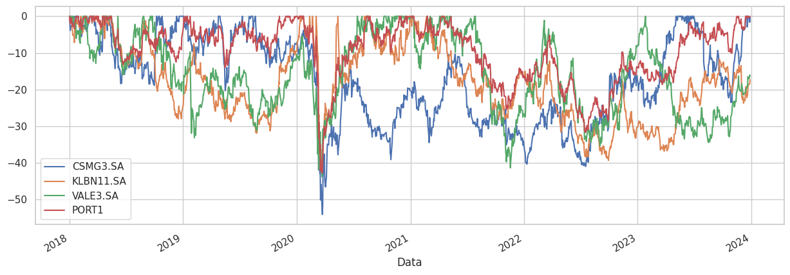

<br />
<div align="center">
  <a href="https://github.com/othneildrew/Best-README-Template">
    
  </a>

  <h3 align="center">Fronteira Eficiênte de Markowitz</h3>

  <p align="center">
    Neste repositório, apliquei na prática a teoria da Fronteira Eficiente de Markowitz para encontrar a melhor diversificação entre os portifólios contendos os seguintes ativos: CSMG3, KLBN11, BBSE3, VALE3, TAEE11 e BBAS3
  </p>
</div>


## A Teoria dos Portifólios
- A teoria parte do princípio de que os investidores são avessos ao risco, preferindo sempre uma carteira com menor risco para um mesmo nível de retorno.
- Ela foi um marco na economia financeira, pois introduz a ideia de que o <strong>risco e o retorno</strong> de um investimento devem ser analisados de forma conjunta para construir um portfólio eficiente. 
- Markowitz demonstrou que, ao <strong>diversificar os investimentos em diferentes ativos</strong>, é possível reduzir o risco global do portfólio sem necessariamente comprometer o retorno esperado.
- Essa diversificação ocorre porque os ativos individuais têm diferentes comportamentos em diferentes condições de mercado, o que pode <strong>reduzir a volatilidade do portfólio</strong> como um todo.

## O que seria a Fronteira Eficiênte de Markowitz?

- Investidores racionais, escolheriam uma carteira situada na Fronteira Eficiente, pois estas carteiras oferecem o melhor 'trade off' possível entre risco e retorno, pois estariam <strong>aplicando a Teoria dos Portifólios na prática</strong>.
- Em um gráfico onde o eixo horizontal representa o risco (medido pelo desvio padrão dos retornos) e o eixo vertical representa o retorno esperado, a Fronteira Eficiente aparece como uma curva que inclui todas as carteiras com o menor risco possível para cada nível de retorno esperado.


## Sobre o código

O código em python, localizado no notebook ``main.ipynb``, realiza a busca de dados de fechamentos dos ativos no banco de dados do ``Yahoo Finance`` entre `Janeiro de 2018` até `Dezembro de 2023`.

Com isso, é construido um portifólio de exemplo com 3 ativos: <strong>CSMG3, KLBN11 e VALE3 </strong>.

A distribuição em porcentagem dos ativos desse portifólio é calculada minimizando a sua volatilidade.

## Resultados

De acordo com as análises de fechamentos, e os cálculos para realizar a distribuição de pesos de alocação dos ativos no portifólio, o resultado obtivo foi esse:

- CSMG3: 30%
- KLBN11: 55%
- VALE3: 15%

O gráfico plotado da fronteira eficiênte de Markowitz foi o seguinte:

<div align="center">
  <a href="https://github.com/othneildrew/Best-README-Template">
    
  </a>
</div>

Sendo assim, os resutlados gerais comparando entre sí os ativos e a aplicação do portifólio seriam:

```cmd
RENTABILIDADE ANUIZADA:
CSMG3.SA     19.27
KLBN11.SA     9.62
VALE3.SA     23.06
PORTFOLIO    15.08


VOLATILIDADE ANUIZADA:
CSMG3.SA     36.53
KLBN11.SA    30.34
VALE3.SA     39.05
PORTIFOLIO   24.07
```

Abaixo está o gráfico de Drawdown:

<div align="center">
  <a href="https://github.com/othneildrew/Best-README-Template">
    
  </a>
</div>
